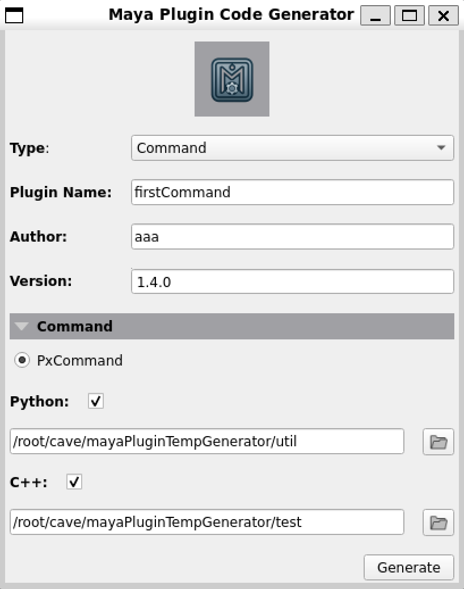
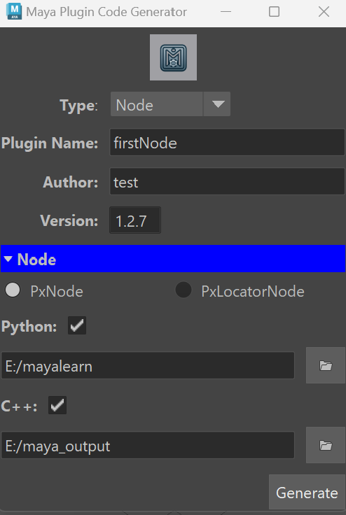

# Maya Plugin Code Generator

## Introduction

The Maya Plugin Code Generator is a powerful tool designed to simplify the process of creating Maya API boilerplate code. With a clear and easy-to-use graphical user interface (GUI), users can quickly generate the necessary code for various types of Maya plugins, making development faster and more efficient.

## Features

- **User-Friendly Interface**: Intuitive GUI for easy navigation and code generation.
- **Support for Multiple Plugin Types**: Generate boilerplate code for different types of Maya plugins, including commands and nodes.
- **Customization Options**: Customize the generated code with specific details.And the version spin box can be controlled as ladder way(middle mouse)
- **Template-Based Generation**: Utilize pre-defined templates to ensure consistent and error-free code.
- **Multiple platform**: Can work as a stand-alone application or be part of the Maya Gui

## GUI Overview

- **Type Selection**: Choose the type of plugin you want to generate (e.g., Command, Node).
- **Plugin Information**: Enter details such as plugin name, author, and version.
- **Detail Selection**: Choose the detail Node(PxNode,PxLocatorNode) or Command(PxCommand) Type.
- **Language Options**: Select the programming language (Python or C++).
- **File Path Selection**: Specify the file paths for the generated code.
- **Generate Button**: Click to generate the boilerplate code based on the provided inputs.Also with a input check




## Included Templates

- **PxCommand Template**: Includes a translation command example. This provides a practical demonstration of how to implement command plugins in Maya.
- **PxLocatorNode Template**: Features a HelloWorld draw node example. This example helps users understand how to create custom locator nodes.
- **PxNode Template**: Contains a RollingNode example, illustrating how to develop custom nodes with specific behaviors in Maya.

These examples are provided within comments, so users can either use them as a starting point or remove them to obtain a clean, minimal template.


## Installation

### Prerequisites

- Autodesk Maya (for running the generator within Maya)
- Python 3.x
- PySide2
- PyTest (for running the test)

### Clone the Repository

```sh
git clone git@github.com:NCCA/msccavepipelineandtdproject24-Marshall-Hao.git
cd msccavepipelineandtdproject24-Marshall-Hao
```

### Install Dependencies
```sh
pip install PySide2 pytest pytest-qt
```

## Usage

### Running in a Standalone Environment

To run the generator outside of Maya, simply execute the main script:

```sh
python main.py
```

### Running within Maya

To run the generator inside Maya, you can add the script directory to your Python path and execute it from Maya's Script Editor:

```python
import sys
sys.path.append(r"absolute path") # ex:E:\mayalearn\mayaPluginTempGenerator
from main import CodeGeneratorWindow,maya_main_window

try:
  code_generator.close() 
  code_generator.deleteLater() 
except:
  pass
code_generator = CodeGeneratorWindow(maya_main_window())
code_generator.show()
```

recommend to save the script to Shelf for easy accessing in the future

### Test

To run the test file, simply navigate to the test folder

```sh
cd test
pytest test_code_generator.py
```

